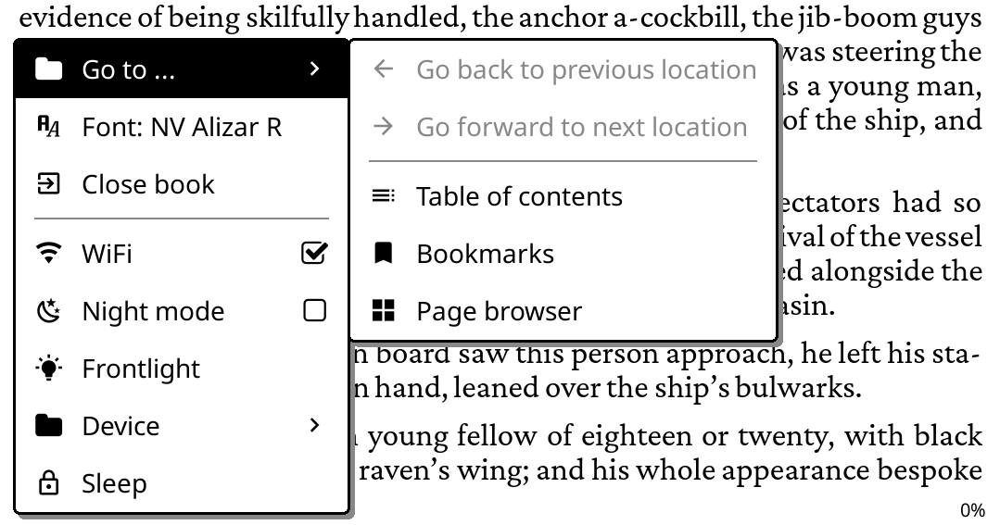

# MiniMenu for KOReader



Create popup menus you can open from a tap, gesture, or another
plugin.  
Inspired by the start menu in [Bookshelf](https://github.com/AndyHazz/bookshelf.koplugin).

## Install

Download `minimenu.koplugin.zip` from the
[latest release](https://github.com/vishnumad/minimenu.koplugin/releases/latest),
unzip it into KOReader's `plugins/` folder and restart.

## Updating

Choose **Tools › MiniMenu › Check for updates**. If you installed v1.0.0
or v1.0.1, update by hand once, as above.

## Usage

1. **Tools › MiniMenu › New menu…** creates a new menu.
2. Open the menu's page and choose **Edit items…** to add, remove and
   arrange items.
3. Bind it in **Settings › Taps and gestures › Gesture manager** under
   **General › MiniMenu: <name>**.

## Development

Install project dependencies with `mise install`.  
Set up [mise](https://github.com/jdx/mise) if you don't have it.

```sh
make check
make lint
make fmt
make fmt-check
make test       
make integration KOREADER_DIR=<emulator>/koreader # Add KO_PLUGINS_DISABLED=zenos to skip plugins installed in the emulator
```

### Releasing

```sh
make release VERSION=x.y.z
git push origin master vx.y.z
```

`make release` runs `make check`, sets the version in `_meta.lua`, then
commits and tags the release. Pushing the tag builds the zip and publishes
the release.

### Icons
`minimenu/icons/glyphs.lua` is generated from KOReader's bundled symbols font:

```sh
mise exec uv@latest -- uv run --no-project --with fonttools \
    python tools/gen_glyphs.py <koreader>/resources/fonts/nerdfonts/symbols.ttf
```
